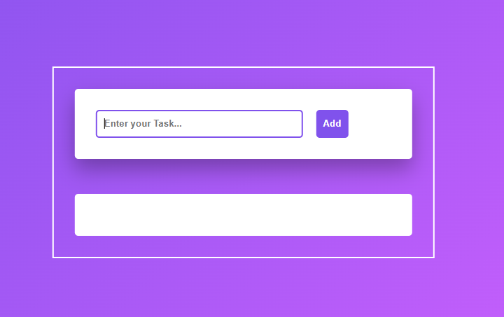

# To-Do List App
A simple and efficient To-Do List application built using **HTML, CSS, and JavaScript**.
This app helps users manage daily tasks by adding, completing, and deleting items.

Live Demo
(https://bilalmustofa.github.io/Todo-list-app-JavaScript/)

Features
* ➕ Add new tasks
* ✅ Mark tasks as completed
* ❌ Delete tasks
* 💾 Save tasks using Local Storage
* ⚡ Fast and user-friendly interface

Technologies Used
* HTML5
* CSS3
* JavaScript (ES6)

This project was created to practice:
* DOM manipulation
* Event handling
* Working with Local Storage
* JavaScript logic building

Future Improvements
* 🎨 Improve UI/UX design
* 📱 Make it fully responsive
* 🌙 Add dark/light mode
* 🔔 Add reminders/notifications

Thanks for checking out this project!
Feel free to give feedback or suggestions.
⭐ If you like this project, don’t forget to star the repository!

